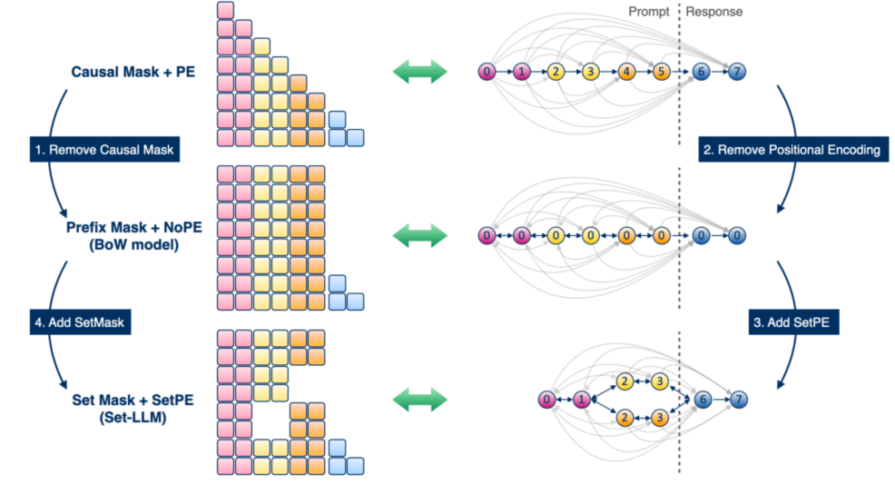

# Study of setLLM: permutation invariant PE and mask

Extending Set-LLM from MCQ invariance to open-ended pairwise judging

- Project: `setLLM`
- Current base path: pairwise `LLM-as-a-judge`
- Core comparison: `vanilla` vs `setllm` vs `setcausal`

---

## Motivation

- Pairwise LLM judges are often sensitive to whether a candidate appears as `A` or `B`
- Protocol fixes such as judging both orders increase inference cost
- Set-LLM already shows permutation invariance on MCQ benchmarks
- The open question: **does architectural invariance still help when each set element is a long multi-paragraph response?**

> Working hypothesis: for long judge responses, `setcausal` may be a better inductive bias than full prompt-side `SetMask`, because all SOTA LLMs are decoder-only and trained with casual mask.

---

## Project Question

We frame the paper around one main question:

**Can architecture-level permutation invariance for open-ended pairwise judging match strong debiasing baselines at lower cost?**

- Input: shared prompt + unordered set of candidate responses
- Output: judge label `A`, `B`, or `Tie`
- Goal: improve robustness without paying multi-order inference cost

---

## Method Variants

| Variant | Prompt attention inside a response | Cross-response attention | Intended role |
| --- | --- | --- | --- |
| `vanilla` | standard decoder causal | allowed through normal prompt order | baseline |
| `setllm` | SetPE + paper-style SetMask | blocked | original Set-LLM adaptation |
| `setcausal` | decoder causal within each response | blocked | long-response judge variant |

- `setcausal` keeps the prompt decoder-style while preventing response leakage
- This stays closer to decoder-only pretraining than full prompt-side SetMask

---

## Current Experimental Scope

- **Task:** pairwise judging first; listwise and rubric formats are deferred
- **Datasets prepared or targeted:** JudgeBench, MT-Bench, LLMBar, FairEval prompt ablations, Chatbot Arena next
- **Training:** LoRA on decoder-only HF models, currently Gemma 2B pilots
- **Compute:** Vast.ai remote GPUs, W&B for tracking

Key metrics in the current pipeline:

- `accuracy`
- `swap_consistency`: fraction of examples where the judgment stays the same after swapping response order
- `first_position_win_rate`: fraction of original-order prompts where the model chooses the response shown first
- `swapped_first_position_win_rate`: fraction of swapped-order prompts where the model still chooses the response shown first in that swapped presentation

---

## Set-LLM Paper Reproduction Result

Before the judge experiments, the repo reproduced the paper-style MCQ setting with Gemma 2B.

| Method | ARC | CSQA | PIQA | SIQA |
| --- | ---: | ---: | ---: | ---: |
| `setllm` | `56.52 / 56.52` | `76.90 / 76.90` | `85.20 / 85.20` | `76.25 / 76.25` |
| `setcausal` | `51.51 / 51.51` | `75.27 / 75.27` | `81.01 / 81.01` | `75.9 / 75.9` |
| paper `Set-LLM + PEUltra` | `65.02 / 65.02` | `80.18 / 80.18` | `85.80 / 85.80` | `76.15 / 76.15` |
| paper `Causal Mask + PEUltra` | `56.32 / 26.88` | `77.89 / 68.47` | `83.98 / 77.31` | `74.33 / 63.97` |

- numbers are `random / adversarial` accuracy
- reproduced `setllm`/`set-casual` keeps full adversarial-order robustness across all four MCQ benchmarks and `set-casual` underperforms
- reproduced `setllm` is close to the paper `Set-LLM + PEUltra` result on `PIQA` and `SIQA`, but still below it on `ARC` and `CSQA`
- the likely reason the reproduction is weaker is that this repo does not include the paper's UltraFeedback extra-pretraining stage

---

## New Update: JudgeBench Prompt Ablations

Labeling problems for long choices(agent response).

All JudgeBench results below use the **corrected** `setcausal` mask semantics.

- Early eval used the negative log likelihood of the single output token `A` or `B`; Gemma 2B showed a strong prior bias toward `A`
- Scoring by the summed negative log likelihood of an entire choice body instead makes the model prefer shorter choices, so length bias replaces token bias
- We use the hash value of choice as its label: H_XXXX to mitigate label bias. (We cannot use `Tie` token anymore because the model prefers `Tie` much more over hash labels).
- In the main prompt, if both hash shows up like "which is better: H_1234 or H_8978", the model prefer the label that shows up first. So we have to use "which is better: H_" as the instruction. 
- After all these fixes, the distribution of choices made by the model is much more balanced.

Main lesson:

- Need to be carefull to remove any imposed asymmetry.

---

## JudgeBench: `hlabelprompt` Results

| Model | Accuracy | Adversarial Order Acc. | Swap Consistency |
| --- | ---: | ---: | ---: |
| `vanilla` | `0.48794` | `0.20107` | `0.39678` |
| `setllm` | `0.50134` | `0.50134` | `1.0` |
| `setcausal` | `0.45576` | `0.45576` | `1.0` |

Takeaway:

- removing explicit label-order instructions removed an old shortcut in the prompt
- `setllm` is now the strongest model on this cleaner JudgeBench prompt
- corrected `setcausal` becomes fully invariant here, but with weaker raw accuracy than `setllm`
- We ran it with different random seeds but setcasual remains to be the worse at 1000 optimization steps.

---

## JudgeBench: `answerlabel` Results

| Model | Accuracy | Adversarial Order Acc. | Swap Consistency |
| --- | ---: | ---: | ---: |
| `vanilla` | `0.49598` | `0.17962` | `0.35121` |
| `setllm` | `0.47721` | `0.47721` | `1.0` |
| `setcausal` | `0.48257` | `0.48257` | `1.0` |

Takeaway:

- repeating the label after each response helps corrected `setcausal` recover accuracy
- this supports a **label-to-response binding** hypothesis for long decoder-style prompts
- the same redundancy slightly hurts `setllm`, so the best prompt may differ by architecture

---

## JudgeBench Reproducibility Signal

`answerlabel`, seed `42` vs `123`:

- `vanilla`: `0.49598 -> 0.49598`
- `setllm`: `0.47721 -> 0.48525`
- `setcausal`: `0.48257 -> 0.47989`

Current read:

- the corrected invariant comparisons are fairly stable across two seeds
- `vanilla` still has the highest clean accuracy, but poor adversarial robustness and much lower consistency
- `setllm` and `setcausal` are now close enough that prompt design may decide the winner

---

## Main Research Tension Right Now

We currently know:

- `setcausal` is conceptually appealing for long responses
- the old `setcausal` mask was wrong and has now been corrected
- earlier `setcausal` results are therefore not apples-to-apples with corrected runs
- corrected JudgeBench runs now show `setcausal` can reach `swap_consistency = 1.0`
- but `setllm` is still stronger on raw accuracy under the best current prompt

So the real question is now:

**Can we improve corrected `setcausal` label binding enough to keep full invariance while closing the clean-accuracy gap to `setllm` and `vanilla`?**

---

## Near-Term Plan

- Run stronger matched ablations on MT-Bench and JudgeBench with the corrected `setcausal` mask
- Run stroger models like gemma4B
- Treat prompt format as an explicit ablation axis, not just implementation detail
- Bring in Chatbot Arena for scale and human-preference correlation
- Add adversarial attacks: whitespace, confident preamble, verbosity, paragraph reorder

Success condition:

- a single-pass invariant judge is competitive with multi-order baselines at lower cost

---

## Paper Framing

Recommended title direction:

**Set-Causal LLM Judges: Permutation-Invariant Open-Ended Pairwise Evaluation**

Core contribution story:

1. Formulate pairwise judging as a set of structured sequences
2. Compare `vanilla`, `SetPE + SetMask`, and `SetPE + setcausal`
3. Prove permutation equivariance for the set-aware architecture
4. Test robustness-cost tradeoffs against inference-time debiasing baselines

---

## Bottom Line

- The infrastructure is working and the project has a real empirical target
- Position bias is clearly present in open-ended judging
- Early results are informative but still too small for scientific conclusions

